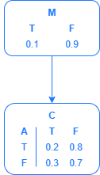

# Bayes Net Autograder Format Checker

This is the format checker given to students to ensure their submission files are in the correct format for their written homework on Bayes Net Logic. The actual autograder is more robust, but I cannot make it publically available due to its active use in the course.

## Motivation

Before I wrote the autograder for the Bayes Net assignment for the class I TA for, the instructional staff had to hand grade all submissions, which included tracing the student's logic as they work their way through the Bayes Net. The homework had 6 written Bayes Net logic parts this semester, so there would be over 1200 submissions needed to be hand graded across all 200+ students in the course. The autograder saves time and automates the process by tracing the student's logic from their submission back down to an expression that should contain only the given values. Then, the autograder substitutes in the given values to ensure it is correct. It also ensures that all values in the final expanded/substituted formula contains only expressions that are actual givens in the Bayes Net. To avoid students using improper logic, they are required to calculate values for all intermediate probabilities used in their work as well, and the autograder compares those values to the true value for the expression that it finds by evaluating the bayes net itself. If the student calculates probabilities for all intermediate probabilities, all the student's calculated probabilities are correct, and the target value simplifies into actual givens while still calculating the correct result, we can be sure that the student's work is correct.

## Usage

Due to the autograder being actively used in class, I cannot post any sample that deals with the true Bayes Net, but I have made a secondary, simplistic Bayes Net to use for demonstration purposes: 

NOTE: Node M has a connection to node C (M and C are used as those are permitted node abbreviations within the format checker). 

To test the format checker, run `py .\check_format.py .\testSubmission.txt 'P(C)'` from the same directory as this README. The two arguments passed in are the submission file (`testSubmission.txt` in the case of the demo) and the goal probability as a string (`'P(C)'` in the case of the demo). It will output a warnings that are useful to the student, but are expected for this demo:
- It will flag that the file name is not correct
- It will throw a few warnings saying that there are multiple equalities on a single line, which is there to help students ensure no required work is overlooked by the autograder
- It will note that the goal probability does not have the expected '=t' or '=f' explicitly assigned as required during student submission

Lastly, the format checker outputs all probability expressions used in its final simplification so that the student can verify that all of them are givens within the Bayes Net. This helps ensire that their logic does trace properly back to the givens while still requiring them to be able to read the Bayes Net to know what probability expressions are givens.

